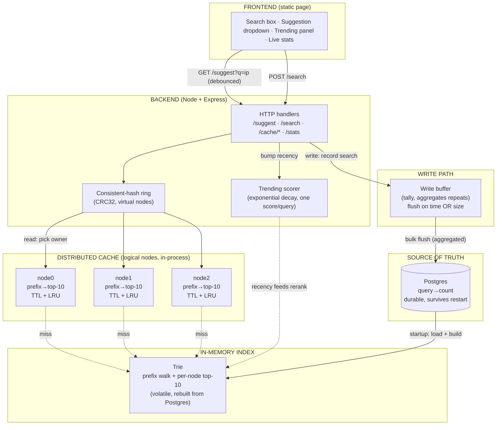

# Search Typeahead

A search-as-you-type service. As you type, it suggests the most popular queries
that begin with your prefix, ranked by popularity; submitting a search records it
and nudges the rankings. Suggestions are served from a distributed in-process
cache sitting in front of an in-memory trie, with Postgres as the durable source
of truth. A recency-aware "trending" mode boosts recently-searched queries, and
search-count writes are batched so the database never sees a write per keystroke.

Written in **TypeScript** on Node.js (Express + node-postgres). The frontend is a
single static page served by the same process. The whole stack — app, Postgres,
and the dataset loader — is containerized and runs with `docker compose up`.

## Features

- Prefix suggestions — top 10 by count, case-insensitive, empty/no-match handled
- Search submission with a stub response, recorded into popularity counts
- Distributed cache over logical nodes, routed by consistent hashing (CRC32 ring)
- Trending mode — recency-aware ranking via exponential time decay
- Batched, aggregated writes — submissions are tallied and flushed in bulk
- A live web UI that surfaces cache hit/miss, owning node, latency, and write
  reduction for every request

## Architecture



Four storage layers, each with a distinct job:

- **Postgres** — durable source of truth (`query, count`); survives restarts and
  receives batched writes.
- **Trie** — in-memory prefix index built from Postgres at startup; answers prefix
  queries fast via a precomputed top-10 at each node. Volatile; rebuilt on boot.
- **Distributed cache** — finished suggestion lists for hot prefixes, spread across
  logical nodes and routed by a consistent-hash ring.
- **Write buffer** — tallies submissions in memory and flushes to Postgres in
  batches.

The full reasoning is in [DESIGN.md](DESIGN.md); measured numbers are in
[PERFORMANCE.md](PERFORMANCE.md). The whole design follows from one fact: reads
(every keystroke) vastly outnumber writes (submissions), so reads are made nearly
free and writes are deferred and batched.

## Setup (Docker — recommended)

Requirements: **Docker** and the AOL query dataset. Nothing else — Node, Postgres,
and all dependencies live in containers.

### 1. Get the dataset

This uses the AOL query log (Kaggle: "AOL User Session Collection"). Download and
unzip it into this directory; you'll get tab-separated files named
`user-ct-test-collection-NN.txt`.

The dataset is **not** committed — it's large and, given the AOL log's history, not
ours to redistribute. Ingestion keeps only the query text; every user-identifying
column (user id, timestamps, clicked URLs) is discarded.

### 2. Start the stack

```
docker compose up -d --build
```

This builds the app image and starts two containers: `postgres` (durable store,
host port **5433**) and `app` (the server, port **8080**). The app waits for
Postgres to be healthy, creates the table if needed, and starts serving — even
with an empty database, so this step never fails on a fresh machine.

### 3. Load the dataset

A one-off `ingest` container (behind a compose profile, so it doesn't run on every
`up`) reads the file and bulk-loads `(query, count)` into Postgres:

```
AOL_FILE=user-ct-test-collection-02.txt docker compose run --rm ingest
docker compose restart app          # rebuild the trie from the loaded data
```

Ingestion normalizes queries (lowercase, trim, drop empty/`-`), aggregates counts
in memory, and bulk-loads them. One file yields ~1.24M unique queries. (Counting
note: every appearance of a query counts toward its popularity — a popularity
proxy, not a strict event count. See DESIGN.md.) The trie is built once at startup,
so the app is restarted to pick up freshly-loaded data.

### 4. Open the UI

Visit **http://localhost:8080/**. Type a prefix (`goog`, `map`, `ebay`), use the
arrow keys to navigate, Enter or the Search button to submit. The panels show what
each request did: latency, cache hit/miss, owning node, and live write-buffer
stats.

To stop: `docker compose down` (add `-v` to also wipe the database volume).

## Setup (local, without Docker for the app)

If you'd rather run the app on the host (e.g. for development), you still need
Postgres — the easiest way is the container:

```
npm install
docker compose up -d postgres                                   # just the DB
npm run ingest -- --file=user-ct-test-collection-02.txt         # uses localhost:5433
npm run server                                                  # serves on :8080
```

The server runs with a raised Node heap (`--max-old-space-size=4096`) because a
trie over 1.24M queries is millions of nodes — see DESIGN.md for the memory notes.
The connection string defaults to `localhost:5433` and is overridable via
`DATABASE_URL`.

## API

| Method | Path | Purpose | Notes |
|---|---|---|---|
| GET | `/suggest?q=<prefix>` | Top 10 prefix matches by count | Add `&mode=trending` for recency-aware ranking |
| POST | `/search` | Record a search, return stub | JSON body `{"query":"…"}`, returns `{"message":"Searched"}` |
| GET | `/cache/debug?prefix=<p>` | Owning node + hit/miss | For demonstrating consistent hashing |
| GET | `/cache/stats` | Per-node hits/misses/size | |
| GET | `/stats` | Write-buffer stats | searches received, flushes, rows written |

### Examples

```bash
# basic suggestions
curl "http://localhost:8080/suggest?q=goog"

# trending (recency-aware) suggestions
curl "http://localhost:8080/suggest?q=goog&mode=trending"

# submit a search (Content-Type header required — Express parses JSON by type)
curl -X POST http://localhost:8080/search \
  -H "Content-Type: application/json" -d '{"query":"iphone"}'

# which node owns this prefix, and is it cached?
curl "http://localhost:8080/cache/debug?prefix=goog"
```

## Demonstrations

### Consistent hashing

```
docker compose run --rm app npm run ringtest    # in a container
# or, running locally:  npm run ringtest
```

Prints the owner of each sample prefix with 3 nodes, then adds a 4th and reports
how many moved. Only keys in the new node's arcs move; the rest keep their owner —
the consistent-hashing property (a node change remaps ~1/N of keys, not nearly
all).

### Performance

```
./scripts/benchmark.sh
```

Measures p95 latency (cache path vs trie path), cache hit rate, and write
reduction through batching. Requires `hey` (`brew install hey`). Results and
interpretation are in [PERFORMANCE.md](PERFORMANCE.md).

### Trending rise-and-fall

In the UI, switch to trending mode and watch a low-ranked query climb after a
burst of searches, then fall back as its recency score decays. The half-life is
configurable in the server config (`trendingHalfLifeMs`) — set it short for a live
demo.

## Project layout

```
src/
  server.ts        entrypoint: config, wiring, lifecycle
  ingest.ts        one-time AOL loader
  ringtest.ts      consistent-hashing demonstration
  store/store.ts   Postgres source of truth
  trie/trie.ts     in-memory prefix index with per-node top-K
  cache/
    cache.ts       distributed cache facade
    ring.ts        consistent-hash ring (CRC32 + virtual nodes)
    node.ts        one logical cache node (TTL + LRU)
  buffer/buffer.ts write buffer (batching + aggregation)
  trending/trending.ts  recency scorer (exponential decay)
  api/handlers.ts  Express routes
web/
  index.html       frontend
scripts/
  benchmark.sh     performance measurement
Dockerfile         app image (server / ingest / ringtest)
docker-compose.yml postgres + app + one-off ingest job
```

## Notes and trade-offs

- Cache nodes are logical (objects in one process), simulating distribution. In
  production they'd be separate processes or Redis instances; the consistent-hash
  routing is identical either way.
- Batching means a hard crash loses buffered-but-unflushed searches — acceptable
  for ranking data; the clean-shutdown path flushes to shrink the window.
- The trie's top-K is computed once at startup. Live count changes go to Postgres
  via the buffer; the trie can be rebuilt periodically or tolerate slight
  staleness, which is fine for ranking.
- See [DESIGN.md](DESIGN.md) for the reasoning behind every choice.
